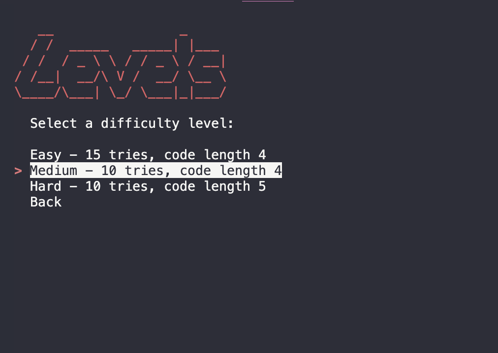

# [PP3 MASTERMIND 2023](https://mastermind2023-c6292244673c.herokuapp.com)

- [Projects GitHub](https://github.com/zakenaio/PP3-MasterMind-2023)

- [My Live Deploy](https://mastermind2023-c6292244673c.herokuapp.com/)

I loved playing MasterMind when I was younger, I was never any good at it, but played it a lot. 
I did [Tech With Tims](https://www.youtube.com/watch?v=sP-gFDreaQ4&themeRefresh=1) version in early summer 2023, and had a lot of ideas of how to improve. 

The player should be greeted by a big friendly Logo. 
MasterMind 
And a menu for easy access to Rules, a way to choose levels, and to quit the game. 
The rules (found here) are really not that hard, but they are extensive
enough to cover a large part of the game screen. 
Not optimal. This was more or less the only reason for the menus. 

I really wanted levels, it would require a major overhaul of the games logic. 
Here the user is greeted by three different options. 

- Easy - Four colors 15 tries
- Medium - Four colors 10 ties 
- Hard - Five color colors 10 tries

The real challange for me was to make this work. Both game mechanics, and menus.
The user needs a seamless way to work. Easy up down and enter.

Single letter input with visual markers for where you have put your color. 
Here is yet another really important part of the new ux, its much easier
for the user to just input one color at the time, with visual feedback.
Instead of all four / or five for hard. 

[ R - - - ] 
[ R G - - ] 

## UX

Screenshot of welcome amiresponsive 

## Features

- **Welcome Screen**

    - The welcome screen invites you with a bold ASCII logo.

    MASTERMIND 
    And a discriptive text of what to do next. 
    Showing the menu options below.

- **Rules Screen**

    - The rules is a must to know, so i decided to really try and include them all. Without it the game with its
    primitive looks might be a bit to hard understand. 

- **screenshot of levels**

    -  After pressing start you are greeted with the Levels. 
    Easy - 15 tries and 4 colors. 
    Medium - 10 tries and 4 colors.
    Hard - 10 tries and 5 colors. 
    Inviting you to continue after you have mastered it once.

- **Placing colors**

    -  In placing colors you get visual feedback on where 
    you have placed the curent color.

- **Positions**

    -  After you have placed your colors you get a screen 
    showing where you have placed them. And the number of 
    correct colors in place, and incorrect place. 
    NOT wich ones, thats the game. 

- **Winner!**

    -  When you have mastered a level and placed your colors correctly.
    You are rewarded with the YOU WIN screen, in bright gold, or yellow
    depends on your spirit. 

### Future Features

I would like to integrate more colors, have all the color options in their real color. 
[ R B G O ] Shown in Red Greeen Blue and Orange. But got into errors, and problems. 
Orange isn’t even a real color in colorama, tried to use the DIM-option but it Wasn’t 
really what I was looking for.

## Tools & Technologies Used

- [Python](https://www.python.org) used as the back-end programming language.
- [Colorama](https://pypi.org/project/colorama/) used to add colors to art.py
- [Simple Term Menu](https://pypi.org/project/simple-term-menu/) used for menus

- [Git](https://git-scm.com) used for version control. (`git add`, `git commit`, `git push`)
- [GitHub](https://github.com) used for secure online code storage.
- [Heroku](https://www.heroku.com) used for hosting the deployed back-end site.

- [VS Code](https://code.visualstudio.com/) used for coding locally

- [Lucid Chart](https://www.lucidchart.com/) used for Flowchart 
- [TextCool](https://textkool.com/en/ascii-art-generator) used to make the logos in art.py 
- [Dillinger.io](https://www.dillinger.io) used to write README and TESTING 

### Flowchart

Below is the flowchart of the main process of this Python program. It shows the entire cycle of the program.

### Functions

The primary functions used on this application are:

- `print_welcome_message()`
    - This function displays a welcome message to the user when the game starts. It uses the os.system('clear') command to clear the terminal before printing the message.

- `display_rules()`
    - This function displays the rules of the game to the user. It also uses the os.system('clear') command to clear the terminal before printing the rules.

- `display_levels()`
    - This function displays the difficulty levels of the game to the user and allows them to select a level. The levels are displayed using the TerminalMenu class from the simple_term_menu module. The function returns the number of tries and the length of the code based on the user's selection.

- `main_menu()`
    - This function displays the main menu of the game to the user and handles their selection. The menu is displayed using the TerminalMenu class from the simple_term_menu module. The function calls other functions based on the user's selection.

- `generate_code(code_length)`
    - This function generates a random code of a specified length from the list of colors. The code is a list of color initials. The function returns the generated code.

- `guess_code(code_length)`
    - This function allows the user to guess the code. It prompts the user to guess a color for each position in the code. The function returns the user's guess as a list of color initials.

- `check_code(guess, real_code, tries)`
    - This function checks the user's guess against the real code. It counts the number of colors in the correct positions and the number of correct colors in the wrong positions. The function prints feedback on the user's guess.

- `game(tries, code_length)`
    - This function runs the game. It generates the real code, allows the user to guess the code, checks the user's guess, and repeats this process until the user guesses the code correctly or runs out of tries. The function prints a message when the game ends.

- `if __name__ == "__main__":`
    - This is the main entry point of the program. It runs the game in a loop, allowing the user to play multiple times without restarting the program.

### Imports / Modules

I've used the following Python packages and/or external imported packages.

- `os`: used for adding a `clear()` function
- `random`: used to get a random choice from a list
- `time`: used to get a 2s delay on quit message`
- `simple_term_menu` used for menus through `TerminalMenu`
- `colorama`: used for including color in the terminal

## Testing

For all testing, please refer to the [TESTING.md](TESTING.md) file.

## Deployment

Code Institute has provided a [template](https://github.com/Code-Institute-Org/python-essentials-template) to display the terminal view of this backend application in a modern web browser.
This is to improve the accessibility of the project to others.

The live deployed application can be found deployed on [Heroku](https://mastermind2023-c6292244673c.herokuapp.com).

### Heroku Deployment

This project uses [Heroku](https://www.heroku.com), a platform as a service (PaaS) that enables developers to build, run, and operate applications entirely in the cloud.

Deployment steps are as follows, after account setup:

- Select **New** in the top-right corner of your Heroku Dashboard, and select **Create new app** from the dropdown menu.

- Your app name must be unique, and then choose a region closest to you (EU or USA), and finally, select **Create App**.

- From the new app **Settings**, click **Reveal Config Vars**, and set the value of KEY to `PORT`, and the value to `8000` then select *add*.

- If using any confidential credentials, such as CREDS.JSON, then these should be pasted in the Config Variables as well.

- Further down, to support dependencies, select **Add Buildpack**.
- The order of the buildpacks is important, select `Python` first, then `Node.js` second. (if they are not in this order, you can drag them to rearrange them)

Heroku needs two additional files in order to deploy properly.

- requirements.txt
- Procfile

You can install this project's **requirements** (where applicable) using:

- `pip3 install -r requirements.txt`

If you have your own packages that have been installed, then the requirements file needs updated using:

- `pip3 freeze --local > requirements.txt`

The **Procfile** can be created with the following command:

- `echo web: node index.js > Procfile`

For Heroku deployment, follow these steps to connect your own GitHub repository to the newly created app:

Either:

- Select **Automatic Deployment** from the Heroku app.

Or: 

Go back to the Deploy tab, scroll down and connect your GitHub. 

After that you go down to Manual Deploy. Choose your branch and click Deploy Branch.

Heroki will now build of that branch using your dependencies used in requirements.txt.

After Heroku has is done you have your deployed project on the link. 

Or:

- In the Terminal/CLI, connect to Heroku using this command: `heroku login -i`
- Set the remote for Heroku: `heroku git:remote -a app_name` (replace *app_name* with your app name)
- After performing the standard Git `add`, `commit`, and `push` to GitHub, you can now type:
	- `git push heroku main`

The frontend terminal should now be connected and deployed to Heroku!

### Local Deployment

This project can be cloned or forked in order to make a local copy on your own system.

For either method, you will need to install any applicable packages found within the *requirements.txt* file.

- `pip3 install -r requirements.txt`.

If using any confidential credentials, such as `CREDS.json` or `env.py` data, these will need to be manually added to your own newly created project as well.

#### Cloning

You can clone the repository by following these steps:

1. Go to the [GitHub repository](https://github.com/zakenaio/PP3-MasterMind-2023) 
2. Locate the Code button above the list of files and click it 
3. Select if you prefer to clone using HTTPS, SSH, or GitHub CLI and click the copy button to copy the URL to your clipboard
4. Open Git Bash or Terminal
5. Change the current working directory to the one where you want the cloned directory
6. In your IDE Terminal, type the following command to clone my repository:
	- `git clone https://github.com/zakenaio/PP3-MasterMind-2023.git`
7. Press Enter to create your local clone.

Alternatively, if using Gitpod, you can click below to create your own workspace using this repository.

Please note that in order to directly open the project in Gitpod, you need to have the browser extension installed.
A tutorial on how to do that can be found [here](https://www.gitpod.io/docs/configure/user-settings/browser-extension).

#### Forking

By forking the GitHub Repository, we make a copy of the original repository on our GitHub account to view and/or make changes without affecting the original owner's repository.
You can fork this repository by using the following steps:

1. Log in to GitHub and locate the [GitHub Repository](https://github.com/zakenaio/PP3-MasterMind-2023)
2. At the top of the Repository (not top of page) just above the "Settings" Button on the menu, locate the "Fork" Button.
3. Once clicked, you should now have a copy of the original repository in your own GitHub account!

## Credits

Tech With Tim [25 min Masterind Python project](https://www.youtube.com/watch?v=sP-gFDreaQ4&themeRefresh=1)

### Content

| Source | Location | Notes |
| --- | --- | --- |
| [Markdown Builder](https://tim.2bn.dev/markdown-builder) | README and TESTING | tool to help generate the Markdown files |
| [TextCool](https://textkool.com/en/ascii-art-generator) | Ascii Art | used to make the logos in art.py |
| [Chris Beams](https://chris.beams.io/posts/git-commit) | version control | "How to Write a Git Commit Message"|
| [Ludid Chart](https://www.lucidchart.com/) | Flowhart / Wireframe | Tool to make Flowchart |
| [Simple Term Menu](https://pypi.org/project/simple-term-menu/) | menus | simple tool to make menus for easy use
| [Dillinger.io](https://www.dillinger.io) | Markdown tool | Fantastic tool for README and TESTING |
| [Colorama](https://pypi.org/project/colorama/) | Colors of logos | Simple tool to colorize logos, and other content |

### Media

### Acknowledgements

- I would like to thank my Code Institute mentor, [Tim Nelson](https://github.com/TravelTimN) for their support throughout the development of this project.
- I would like to thank my Code Institute mentor, [Julia Konovalova](https://github.com/IuliiaKonovalova) for their support throughout the development of this project.
- I would like to thank the [Code Institute](https://codeinstitute.net) tutor team for their assistance with troubleshooting and debugging some project issues.
- I would like to thank the [Code Institute Slack community](https://code-institute-room.slack.com) for the moral support; it kept me going during periods of self doubt and imposter syndrome.
