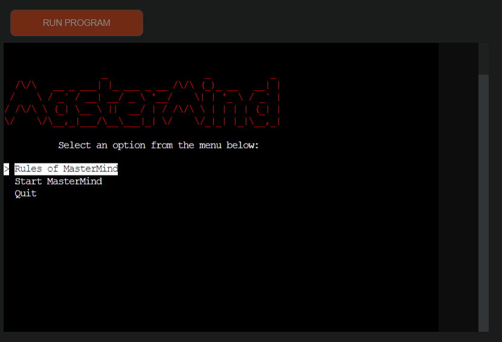
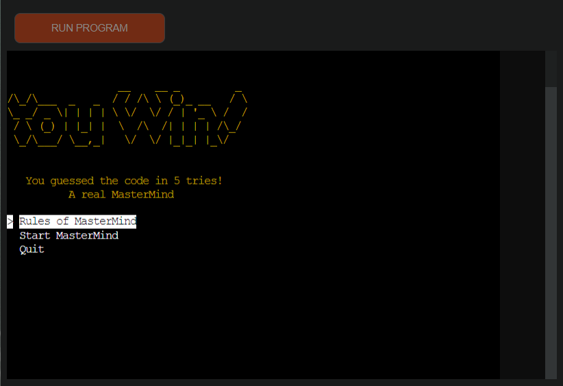
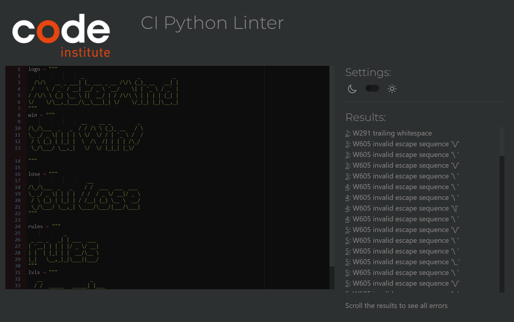

# Testing

Return back to the [README.md](README.md) file.

## Code Validation

### Python

I have used the recommended [PEP8 CI Python Linter](https://pep8ci.herokuapp.com) to validate all of my Python files.

| File | CI URL | Screenshot | Notes |
| --- | --- | --- | --- |
| run.py | [PEP8 CI](https://pep8ci.herokuapp.com/https://raw.githubusercontent.com/zakenaio/pp3-mastermind-2023/main/run.py) |  | Work as expected with zero errors.  |
| art.py | [PEP8 CI](https://pep8ci.herokuapp.com/https://raw.githubusercontent.com/zakenaio/pp3-mastermind-2023/main/art.py) |  | I tried to make a clean file, but if i touched anything it broke horribly. It doesnt affect the anything from a game perpective, its not code, just art.  |

## Defensive Programming

Defensive programming was manually tested with the below user acceptance testing:

| Page | Expectation | Test | Result | Fix | Screenshot |
| --- | --- | --- | --- | --- | --- |
| --- | Non valid color option should prompt a message | --- | It does | --- | 

The use of Simple_term_menu minimized the possibility for input errors. 

## Bugs

- I found this bug, but only sometimes when returning from the rules screen. 
    not every time, just when I spammed rules and return a couple of times.
    It´s NOT the prettiest fix, but it worked. 

    

    - To fix this, I made changes to the lines below. 
    elif menu_entry_index == 1:
        tries, code_length = display_levels()
        if tries is not None and code_length is not None:
            game(tries, code_length)

    - This is the main menu entry. I added the "None" parts, and added:
    elif level_entry_index == 3:
        print_welcome_message()
        return None, None
    
- This bug happened after I had changed the way TRIES and CODE_LENGTH 
    worked, at some places I still tried to use the old Constants. After 
    the change for using menu entries to determine # tries and code length 
    I had to remove every instance of TRIES in the code.

    
    
    - Fixes were to remove all mentions of TRIES as a constant, and use lowercase
    
- This I thought was of the same kind as the TRIES one, it kinda was, but it tried to read the correct/incorrect_pos, that threw me off. It was I who still tried to talk to two unexisting constants, and then tried to read the lists with zip that gave me errors. 

    

    - Change of names fixed it. I found [this](https://www.freecodecamp.org/news/typeerror-cannot-unpack-non-iterable-nonetype-object-how-to-fix-in-python/), but it wasn't really the solution. Just a symptom of the problem. 

## Unfixed Bugs

There are no remaining bugs that I am aware of.

