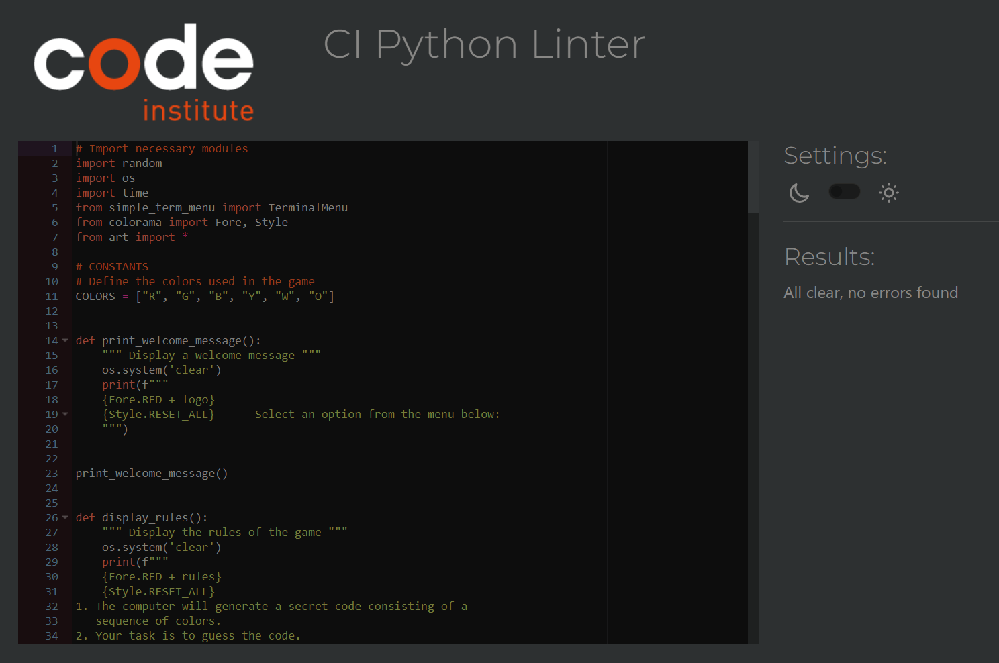

# Testing

Return back to the [README.md](README.md) file.

## Code Validation

### Python

The CI Python Linter can be used two different ways.
- Copy/Paste your Python code directly into the linter.
- As an API, using the "raw" URL appended to the linter URL.
    - To find the "raw" URL, navigate to your file directly on the GitHub repo.
    - On that page, GitHub provides a button on the right called "Raw" that you can click on.
    - From that new page, copy the full URL, and paste it after the CI Python Linter URL (with a `/` separator).
    - Check the example table below for a live demo.

I have used the recommended [PEP8 CI Python Linter](https://pep8ci.herokuapp.com) to validate all of my Python files.

| File | CI URL | Screenshot | Notes |
| --- | --- | --- | --- |
| run.py | [PEP8 CI](https://pep8ci.herokuapp.com/https://raw.githubusercontent.com/zakenaio/pp3-mastermind-2023/main/run.py) |  | |

## Browser Compatibility

I've tested my deployed project on multiple browsers to check for compatibility issues.

| Brave | Safari  | Edge | Firefox |
| --- | --- | --- | --- |
|  |  |   |  | 

## Responsiveness

Is this needed? 
I have nothing with heroku to do?

I've tested my deployed project on multiple devices to check for responsiveness issues.

| Device | Home | About | Contact | etc | Notes |
| --- | --- | --- | --- | --- | --- |
|  |  |  | Noticeable scaling issues |

## Lighthouse Audit

I've tested my deployed project using the Lighthouse Audit tool to check for any major issues.

| Page | Mobile | Desktop | Notes |
| --- | --- | --- | --- |

## Defensive Programming

Defensive programming was manually tested with the below user acceptance testing:

| Page | Expectation | Test | Result | Fix | Screenshot |
| --- | --- | --- | --- | --- | --- |
| --- | Non valid color option should promt a message | --- | It does | --- | 

The use of Simple_term_menu minimized the posibility for input errors. 

## Bugs

- I found this bug, but only sometimes when returning from the rules screen. 
    not everytime, just when i spammed rules and return a couple of times.
    It´s NOT the prettiest fix, but it worked. 

    

    - To fix this, I made changes to the lines below. 
    elif menu_entry_index == 1:
        tries, code_length = display_levels()
        if tries is not None and code_length is not None:
            game(tries, code_length)

    - This is the main menu entry. I added the "None" parts, and added:
    elif level_entry_index == 3:
        print_welcome_message()
        return None, None
    
- This bug happened after i had changed the way TRIES and CODE_LENGHT 
    worked, at some places i still tried to use the old Constants. After 
    the change for using menu entries to determain # tries and code lenght 
    i had to remove every instance of TRIES in the code.

    
    
    - Fixes where to remove all mentions of TRIES as a constant, and use lowercase
    
    
    
- Here i had made a mistake regardning the CODE_LENGTH, spelling of the word LENGTH
    have been an ongoing theme, it gave me more errors than I´d like to admit. And after changning that Constant to the menu options, like with TRIES I had way to many errors showing. 

    

    - Fixes where to correctly spell, and then after removing the Constant, use lowercase. 

## Unfixed Bugs

There are no remaining bugs that I am aware of.

